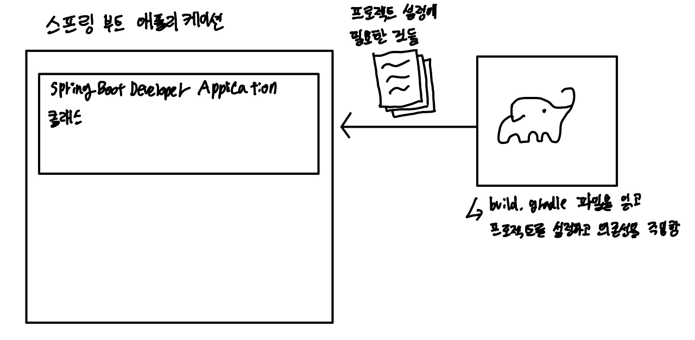
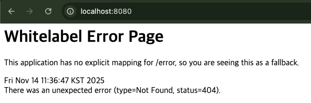

지금까지 백엔드 개발을 할 때 당연하듯 스프링 부트를 사용했지만, 앞으로는 왜 내가 이 프레임 워크를 사용하는지에 대해 알아보려고 동방에 있는 책을 하나 집어왔다. 이 책을 시작으로 스프링 부트에 대해 알아보자. 렛츠고! 

### 그림으로 이해하는 프로젝트

스프링 부트 3가 처음이라면 프로젝트의 구성을 그림과 같이 이해하면 도움이 된다



SpringBootDeveloperApplication 클래스가 있고, 애플리케이션 설정에 필요한 내용을 `build.gradle` 파일에서 읽어 **의존성 주입**을 한다. 프로젝트에서 필요한 설정은 `build.gradle` 파일을 수정하여 주입한다.

### 프로젝트 생성하기


### Build system의 gradle과 maven의 차이점은?

gradle과 maven은 자바에서 사용하는 빌드 관리 도구이다. 

우리가 작성한 코드는 '빌드'를 통해 사용자가 애플리케이션 형태로 사용할 수 있는 모습이 된다.

이 빌드 과정에서 필요한 것들을 자동화하는 도구를 '빌드 관리 도구'라고 한다. 이 과정에는 의존성 내려받기, 코드 패키징, 컴파일, 테스트 실행 등이 포함된다.

예전에는 maven을 많이 사용했지만 지금은 gradle이 대세다. gradle의 특징을 알아보자.

-   메이븐에 비해 가독성이 좋음.
-   자바, 코틀린, 그루비 등 다양한 언어 지원. 원하는 대로 빌드 스크립트 작성 가능
-   빌드와 테스트 속도가 maven보다 빠름

### 스프링 부트 3 프로젝트 만들기

build.gradle 파일을 다음과 같이 수정했다.

```
plugins {
    id 'java'
    id 'org.springframework.boot' version '3.2.0' //스프링 부트 플러그인 추가
    id 'io.spring.dependency-management' version '1.1.0' //의존성 자동 관리 플러그인 추가
}

group = 'me.shinsunyoung' //지정한 그룹 이름
version = '1.0'
sourceCompatibility = '17'

repositories { //의존성 라이브러리를 가져올 저장소 설정
    mavenCentral() 
}

//프로젝트를 개발하면서 필요한 기능의 의존성을 입력하는 부분
dependencies {
    implementation 'org.springframework.boot:spring-boot-starter-web' //웹 애플리케이션 개발에 필요한 스프링 부트 스타터 웹 의존성 추가
    testImplementation 'org.springframework.boot:spring-boot-starter-test' //테스트용 스프링 부트 스타터 테스트 의존성 추가
}

test {
    useJUnitPlatform()
}
```


#### Whitelabel Error Page

Error 404 : 웹사이트에서 요청한 페이지를 찾을 수 없을 때 발생하는 **'페이지를 찾을 수 없음(Not Found)'** 오류. 즉 정상적으로 서버는 정상적으로 열려있고 localhost:8080을 요청하면 index.html을 찾도록 설정되어 있는데 index.html파일이 없어서 404 오류가 나오는 것이다. 따라서 에러가 나오는 것이 정상이고 서버도 정상적으로 열려있는 것이다!



static/index.html에 index.html 파일을 작성하면 오류는 없어지고 localhost:8080을 요청하면 이 파일을 찾아 읽어 띄운다.


