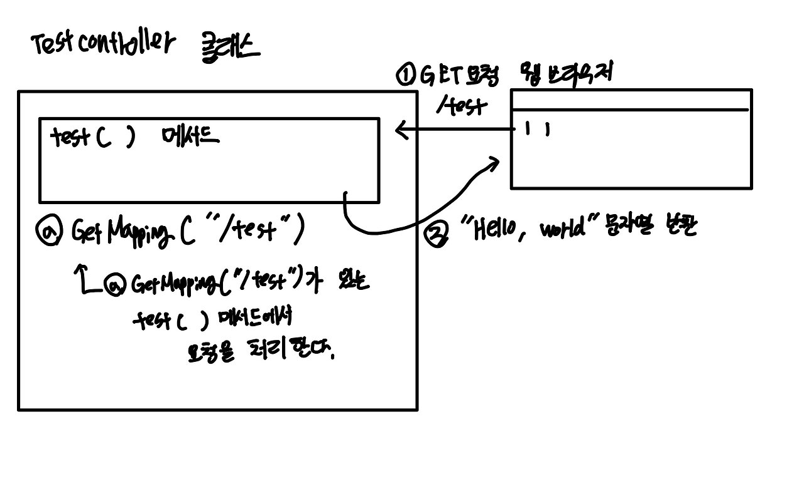
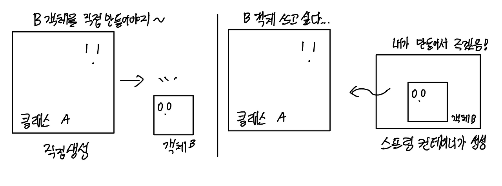

## 그림으로 이해하는 프로젝트

포스트맨으로 GET 요청을 전송하는 단계 구성을 그림으로 표현하면 이러하다.



TestController 클래스가 웹 브라우저의 요청을 받아 test( ) 메서드를 실행하여 문자열을 반환하는 것을 그림으로 나타낸 것이다. 웹 브라우저의 요청을 특정 클래스의 특정 메서드가 어떻게 처리하는지 나타냈다!

## 스프링과 스프링 부트

### 스프링의 등장

엔터프라이즈 애플리케이션는 대규모 복잡한 데이터를 관리하는 애플리케이션을 말한다. 이것은 시간이 지날수록 점점 복잡해졌고, 많은 사용자들이 사용해 서버의 성능, 안정성, 보안이 중요해졌다. 개발을 할 때 이것들을 모두 생각하며 비즈니스로직을 개발하기에 어려웠다. 기능개발을 위한 환경을 제공하고 기능 개발에만 집중할 수 있게 해주는 것이 필요했는데 이것이 스프링 프레임워크이다. 

### 스프링을 더 쉽게 만들어주는 스프링 부트

스프링은 장점이 있지만 아직 설정이 복잡하다는 단점이 남아있었다. 이런 단점을 보완하고자 스프링 부트를 출시했다. 스프링 부트는 스프링 프레임워크를 더 쉽고 빠르게 이용할 수 있도록 만들어주는 도구이다. 더 빠르게 스프링 프로젝트를 설정할 수 있고 의존성 세트라고 불리는 스타터를 사용해서 간편하게 의존성을 관리할 수 있다. 

```
스프링 부트의 주요 특징


- 톰캣, 제티 같은 WAS(web application server)가 내장되어 있어 따로 설치하지 않아도 독립적 실행 가능
- 빌드 구성을 단순화하는 스프링 부트 스타터 제공
- XML 설정을 하지 않고 자바 코드로 모두 작성 가능
- JAR를 이용해 자바 옵션만으로 배포 가능
- 애플리케이션의 모니터링 및 관리 도구인 Spring Actuator 제공
```

#### 스프링과 스프링 부트 특징 비교

|   | 스프링 | 스프링 부트 |
| --- | --- | --- |
| 목적 | 엔터프라이즈 애플리케이션 개발을 더 쉽게 | 스프링 개발을 더 빠르고 쉽게 |
| 설정 파일 | 개발자가 수동 구성 | 자동 구성 |
| XML | 일부 파일은 XML로 직접 생성 및 관리 | 사용 X |
| 인메모리 데이터베이스 지원 | 지원 X | 자동 지원 |
| 서버 | WAS를 별도로 수동 설정 | 내장형 서버를 제공해 별도 설정 필요하지 않음 |

## 스프링 콘셉트 공부하기

### 제어의 역전과 의존성 주입

스프링은 모든 기능의 기반을 제어의 역전(IoC)과 의존성 주입(DI)에 두고 있다.

#### IOC란?

IoC는 Inversion of Control 즉, 제어의 역전을 줄인 말이다.

지금까지 자바 코드를 작성해서 객체를 생성할 때는 객체가 필요한 곳에서 직접 생성했다. 클래스 B를 사용하기 위해 클래스 A를 직접 생성하는 코드가 다음 예시이다.

```
public class A {
	b = new B(); // 클래스 A에서 new 키워드로 클래스 B 객체 생성
}
```

제어의 역전은 ~다른 객체를 직접 생성 제어하는 것~이 아닌 **외부에서 관리하는 객체를 사용하는 것**을 말한다. 제어의 역전을 적용하면 위 코드가 아래 처럼 변한다. 

이전과는 다르게 클래스 B 객체를 직접 생성하는 것이 아닌 어딘가에서 받아오는 것이라고 추측된다. 실제로 스프링은 **스프링 컨테이너**가 객체를 관리, 제공하는 역할을 한다.

```
public class A {
	private B b; //코드에서 객체를 생성하지 않고 어디에서 받아온 객체를 b에 할당함
}
```

#### DI란?

앞에서 말했다시피 스프링에서는 객체들을 관리하기 위해 IoC를 사용한다. 이 IoC를 구현하기 위해 사용하는 방법이 DI이다. 

DI는 Dependency Injection을 줄인 말이고 직역하면 의존성 주입이다. DI는 어떤 클래스가 다른 클래스에 의존하고 있다라는 뜻이다. 

@Autowired라는 애너테이션은 스프링 컨테이터에 있는 Bean이라는 것을 주입하는 역할을 한다. **Bean은 쉽게 말해 스프링 컨테이너에서 관리하는 객체**를 말한다. 추가 설명은 이후에 하고 우선은 이 정도로만 기억해두자. 

이전 코드에서는 개발자가 직접 객체 B를 생성했고 밑에 코드는 어딘가에서 B b;라고 선언했을 뿐 직접 객체를 생성하지 않고 있다.(객체를 주입받고 있다.)

```
// IoC/DI를 기초로하는 스프링 코드. 객체를 주입받는 모습 예
public class A {
	//A에서 B를 주입받음
    @Autowired
    B b;
}
```

이렇게 코드를 작성해도 프로그램은 잘 작동하는데 지금까지의 지식으로는 이해가 가지 않는다. 다음을 보면 이해할 수 있다.

위 코드가 잘 작동하는 이유는 스프링 컨테이너라는 곳에서 객체를 주입했기 때문이다. 쉽게 말해 스프링 컨테이너가 B 객체를 만들어 클래스 A에 전달한 것이다.



그림처럼 기존의 자바 코드는 클래스 A에서 객체 B를 쓰고 싶다면 직접 생성했다. 하지만 스프링의 경우는 클래스 A에서 B 객체를 쓰고 싶은 경우에는 객체를 직접 생성하는 것이 아닌 스프링 컨테이너에서 객체를 주입받아 사용한다.

**IoC/DI 개념은 스프링의 정수이므로 반드시 이해하고 기억하자.**

### 빈과 스프링 컨테이너

#### 스프링 컨테이너란?

스프링은 스프링 컨테이너를 제공한다. 스프링 컨테이너는 빈을 생성하고 관리한다. 빈이 생성되고 소멸되기까지 생명주기를 이 스프링 컨테이너가 관리한다. 또한 개발자가 @Autowired 같은 애너테이션을 사용해 빈을 주입받을 수 있게 DI를 지원하기도 한다. 

#### 빈이란?

앞에서 말한 것 처럼 빈은 스프링 컨테이너가 생성하고 관리하는 객체이다. **아까 위 그림에서 B가 빈이다.** 스프링은 빈을 스프링 컨테이너에 등록하기 위해 XML 파일 설정, 애너테이션 추가 등의 방법을 제공한다. 즉, 빈을 등록하는 방법은 여러 가지로 많다.

예시로 MyBean 클래스에 @Component 애너테이션을 붙이면 MyBean 클래스가 빈으로 등록된다. 이후 스프링 컨테이너에서 이 클래스를 관리한다. 이때 빈의 이름은 클래스 이름의 첫 글자를 소문자로 바꿔서 관리한다. 

MyBean 클래스의 빈 이름 == myBean

```
//클래스를 빈으로 등록하는 방법 예시
@component // 클래스 MyBean을 빈으로 등록해주는 애너테이션
public class MyBean {
}
```

빈이 자주 나올 텐데 어려워하지 말고 스프링에서 제공하는 객체라고 생각하자.

### 관점 지향 프로그래밍

#### AOP란? 

Aspect Oriented Programming을 줄인 말이다. 관점 지향 프로그래밍을 뜻한다. 이것도 스프링에서 중요한 개념이니 알아두자. AOP는 프로그래밍에 대한 관심을 핵심 관점과 부가 관점으로 나누어서 관심을 기준으로 모듈화하는 것을 의미한다. 예시는 접어두겠다.

더보기

예를 들어 계좌 이체, 고객관리하는 프로그램이 있다고 가정해보자. 각 프로그램에는 로깅 로직(지금까지 벌어진 일을 기록하는 로직)과 여러 데이터를 관리하기 위한 데이터베이스 연결로직이 있다.

핵심 관점: 계좌 이체, 고객 관리 로직

부가 관점: 로깅, 데이터 베이스 연결 로직 

로깅, 데이터베이스 연결은 모두 계좌 이체와 고객 관리에 필요하다. AOP 관점을 적용하면 부가 관점에 해당하는 로직을 모듈화 해서 개발할 수 있다. 부가 관점과 핵심 관점 코드를 분리하게 되면 개발자는 핵심 관점 코드만 집중할 수 있고 프로그램 확장, 변경에 유연하게 대응할 수 있다.

### 이식 가능한 추상화

#### PSA란?

PSA는 Portable Service Abstraction을 줄인 말이다. 이식 가능 서비스 추상화를 뜻한다. 스프링에서 제공하는 다양한 기술들을 추상화해서 개발자가 쉽게 사용하는 인터페이스를 말한다. 예시는 접어두겠다.

더보기

PSA 예시

PSA의 예는 클라이언트의 매핑과 클래스, 메서드의 매핑을 위한 애너테이션이 있다. 

스프링에서 데이터베이스 접근 기술에는 JPA, MyBatis, JDBC 등이 있는데, 여기에서 어떤 기술을 사용하든 일관된 방식으로 데이터베이스에 접근할 수 있도록 인터페이스를 지원한다. 

WAS도 다른 예시로 볼 수 있다. 코드는 그대로 유지하되 WAS를 톰캣이 아닌 언더토우, 네티와 같은 다른 곳에서 실행을 하더라고 기존 코드를 그대로 사용할 수 있다.

#### 정리

스프링 프레임워크는 IoC/DI를 통해 객체 간의 의존 관계를 생성하고, AOP를 통해 핵심 관점과 부가 관점을 분리하여 개발하며, PSA를 통해 추상화 된 다양한 서비스를 일관된 방식으로 사용하게 한다.

```
IoC: 객체의 생성을 개발자가 아닌 프레임워크가 대신하는 것
DI: 외부에서 객체를 주입받아 사용하는 것
AOP: 프로그래밍을 할 때 관점을 핵심과 부가로 나누어 개발하는 것
PSA: 어느 기술을 사용하던 일관된 방식으로 처리하게 하는 것
```